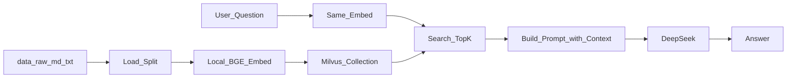

# Lang Chain RAG 学习项目

> 目标：基于**本地 Markdown/txt 笔记**，用**本地 BGE 嵌入 + Milvus 检索 + DeepSeek 生成**，跑通一条最小 RAG。  
> **业务逻辑由你自己写**；仓库已按正常项目划分模块，函数内多为 `NotImplementedError` 占位。

相关练习：上级目录 `Lang Chain/01.py`～`04.py`（调 LLM / 异步）；本目录专注「切分 → 向量 → 检索 → 带上下文生成」。

---

## 1. 技术选型（已拍板）

| 项 | 选择 | 说明 |
|----|------|------|
| 知识库 | 本地 `.md` / `.txt` | 放入 [`data/raw/`](data/raw/) |
| 向量库 | **Milvus** | Docker，默认 `http://localhost:19530` |
| 嵌入 | **本地** `BAAI/bge-large-zh-v1.5`（**1024 维**） | **需自行下载一次权重**（见阶段 2）；之后可离线 |
| LLM | **DeepSeek** | 复用 `DEEPSEEK_API_KEY` / `DEEPSEEK_BASE_URL` |

### 嵌入「要不要自己下载」

- **要**：第一次把嵌入模型拉到本机缓存（类似以前的 `bert-base-chinese`）。  
- **不要误解**：下载的是「文本 → 向量」模型；最终回答仍由 **DeepSeek API** 生成。  
- 国内建议在下载前设置：`$env:HF_ENDPOINT="https://hf-mirror.com"`（PowerShell）。

### 本阶段不做

- Agent / Tool 调用链  
- PDF、网页爬取（以后可扩展）

---

## 2. 数据流



主入口：

```powershell
python ingest.py      # 入库
python query.py       # 问答
python check_env.py   # 可选：环境自检
```

在 `Lang Chain/RAG/` 下运行（保证 `import rag` 能找到包）。

---

## 3. 目录结构

```text
Lang Chain/RAG/
├── README.md
├── .env.example / .env
├── requirements.txt
├── ingest.py              # CLI：入库
├── query.py               # CLI：交互问答
├── check_env.py           # CLI：Milvus / 嵌入维数自检
├── rag/                   # 业务包
│   ├── __init__.py
│   ├── config.py          # 读 .env
│   ├── loader.py          # 加载 + 切分
│   ├── embeddings.py      # 本地 BGE
│   ├── vectorstore.py     # Milvus 写入 / 连接
│   └── qa.py              # 检索 + prompt + DeepSeek
├── data/
│   └── raw/               # 你的 .md / .txt 笔记
└── outputs/               # 可选：问答日志
```

按职责改对应文件即可，不必再用编号脚本。

---

## 4. 环境准备

### 4.1 依赖

```powershell
conda activate california-dl
cd "F:\code\deep-learning-notes\Lang Chain\RAG"
pip install -r requirements.txt
```

### 4.2 Milvus（Docker）

本机已按 Standalone 装在 **`D:\milvus`**（compose + 数据卷 `D:\milvus\volumes`），端口 **19530**。

```powershell
D:\milvus\start.ps1   # 启动
D:\milvus\stop.ps1    # 停止（保留数据）
curl http://localhost:9091/healthz   # 应返回 OK
```

说明见 `D:\milvus\README.md`。在 `check_env.py` 里可用 `pymilvus` 的 `connections.connect` 再测一遍。

### 4.3 `.env` 说明（重要）

1. 复制模板：`copy .env.example .env`  
2. 也可把上级 [`Lang Chain/.env`](../.env) 里的 DeepSeek 键拷过来；`rag/config.py` 已尝试再 load 上级 `.env`。  
3. **修正笔误**：若旧配置写成 `MILVUS—_URL`（中间是汉字破折号 `—`），必须改成 **`MILVUS_URI`**（ASCII 下划线），否则 `os.getenv` 读不到。  
4. `KNOWLEDGE_BASE_PATH` 建议指向本项目的 `data/raw`（相对路径相对 RAG 根目录解析）。  
5. `EMBEDDING_MODEL_NAME=BAAI/bge-large-zh-v1.5`，`EMBED_DIM=1024`（与模型一致；旧字段名 `EMBE_DIM` 建议统一为 `EMBED_DIM`）。

---

## 5. 分阶段学习路线（你自己写代码）

| 阶段 | 改哪些文件 | 你要完成的事 | 建议验收 |
|------|------------|----------------|----------|
| **0** | `config.py`、`check_env.py`、`.env` | Docker 起 Milvus；填好环境；装依赖 | 能 connect 到 19530 |
| **1** | `loader.py` | 加载 `data/raw`，递归字符切分 | `print` 若干 chunk 与 metadata |
| **2** | `embeddings.py` | 本地嵌入 → 1024 维 | `len(vector)==1024`；首次会下载 |
| **3** | `vectorstore.py`、`ingest.py` | 建 collection、写入、检索抽测 | TopK 能命中相关片段 |
| **4** | `qa.py`、`query.py` | 检索 + 拼 prompt + DeepSeek | 有上下文能答；无关题应说不知 |
| **5**（加分） | `qa.py` | 流式输出 / 打印引用来源 | 参考上级 `04.py` 的 `astream` |

建议超参初值：

- `chunk_size=500`，`chunk_overlap=50`  
- 检索 `TopK=3`～`5`  
- System：要求**仅根据提供的上下文**回答，并尽量注明来源文件名  

---

## 6. 模块职责与骨架提示

各文件里已有函数签名与 `NotImplementedError`；实现时注意：

| 模块 | 关键 API（提示） |
|------|------------------|
| `loader.py` | `DirectoryLoader` / `TextLoader`、`RecursiveCharacterTextSplitter` |
| `embeddings.py` | `HuggingFaceEmbeddings` 或 `SentenceTransformer.encode` |
| `vectorstore.py` | `pymilvus` / LangChain `Milvus` vectorstore |
| `qa.py` | `similarity_search`、`init_chat_model`（同上级 `01.py`～`03.py`） |

`ingest.py` / `query.py` 只负责编排调用，业务写在 `rag/` 包内。

---

## 7. 验收清单

- [ ] Milvus 可连接；`.env` 键名无中文破折号  
- [ ] `data/raw` 至少有 2～3 篇自己的笔记  
- [ ] 入库后向量维度为 **1024**  
- [ ] 提问笔记里出现过的概念，回答能对应上原文要点  
- [ ] 提问无关内容时，模型表示上下文不足（或等价表现）  

---

## 8. 常见坑

| 现象 | 可能原因 |
|------|----------|
| `getenv` 一直是 `None` | `MILVUS—_URL` 等错误键名；未在 RAG 目录加载 `.env` |
| `ModuleNotFoundError: rag` | 未在 `Lang Chain/RAG` 根目录执行 |
| 嵌入维度报错 | 模型与 `EMBED_DIM` 不一致；或 collection 建表时 dim 写错 |
| HF 下载超时 | 设置 `HF_ENDPOINT` 镜像；磁盘空间（C 盘）不足 |
| 检索全不相关 | 未用「同一」嵌入模型查询；chunk 过大/过小；尚未重新 ingest |
| DeepSeek 慢 | 远程 API + 上下文过长；先减 TopK / 减 chunk |

---

## 9. 与上级练习的关系

| 文件 | 可复用点 |
|------|----------|
| `01.py` / `03.py` | `init_chat_model`、messages 列表 |
| `04.py` | `ainvoke` / `astream`（阶段 5） |
| `tool.py` | 本项目不做 Tool；勿与 RAG 混为一谈 |

---

*框架文档 · 实现留白供自学填写。*
